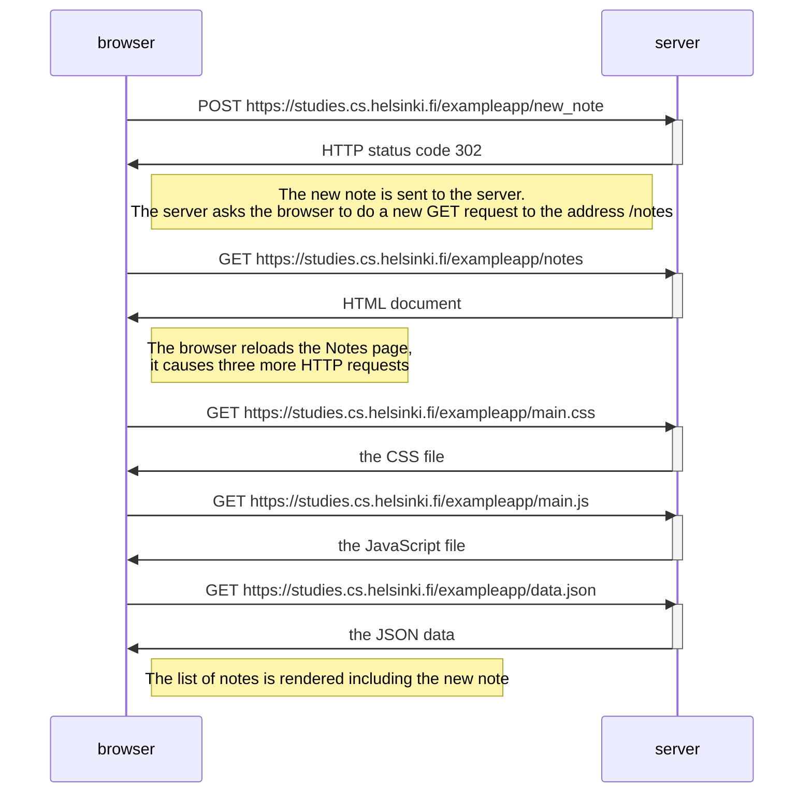

```mermaid

sequenceDiagram
    participant browser
    participant server

    browser->>server: POST https://studies.cs.helsinki.fi/exampleapp/new_note
    activate server
    server->>browser: HTTP status code 302
    deactivate server

    Note right of browser: The new note is sent to the server. <br> The server asks the browser to do a new GET request to the address /notes

    browser->>server: GET https://studies.cs.helsinki.fi/exampleapp/notes
    activate server
    server->>browser: HTML document
    deactivate server

    Note right of browser: The browser reloads the Notes page, <br> it causes three more HTTP requests

    browser->>server: GET https://studies.cs.helsinki.fi/exampleapp/main.css
    activate server
    server->>browser: the CSS file
    deactivate server

    browser->>server: GET https://studies.cs.helsinki.fi/exampleapp/main.js
    activate server
    server->>browser: the JavaScript file
    deactivate server

    browser->>server: GET https://studies.cs.helsinki.fi/exampleapp/data.json
    activate server
    server->>browser: the JSON data
    deactivate server

    Note right of browser: The list of notes is rendered including the new note

```
