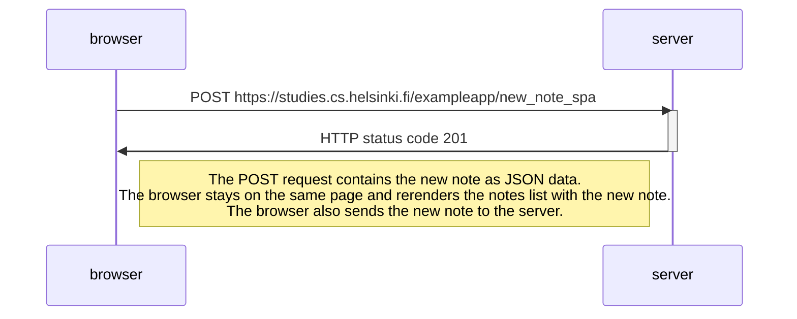

```mermaid

sequenceDiagram
    participant browser
    participant server

    browser->>server: POST https://studies.cs.helsinki.fi/exampleapp/new_note_spa
    activate server
    server->>browser: HTTP status code 201
    deactivate server

    Note right of browser: The POST request contains the new note as JSON data. <br> The browser stays on the same page and rerenders the notes list with the new note. <br> The browser also sends the new note to the server.

```
